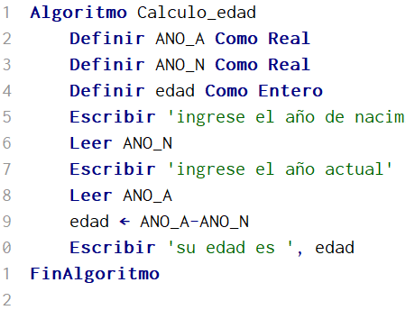
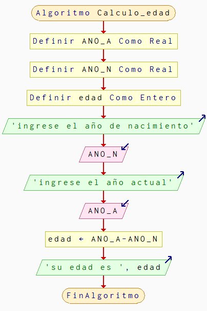
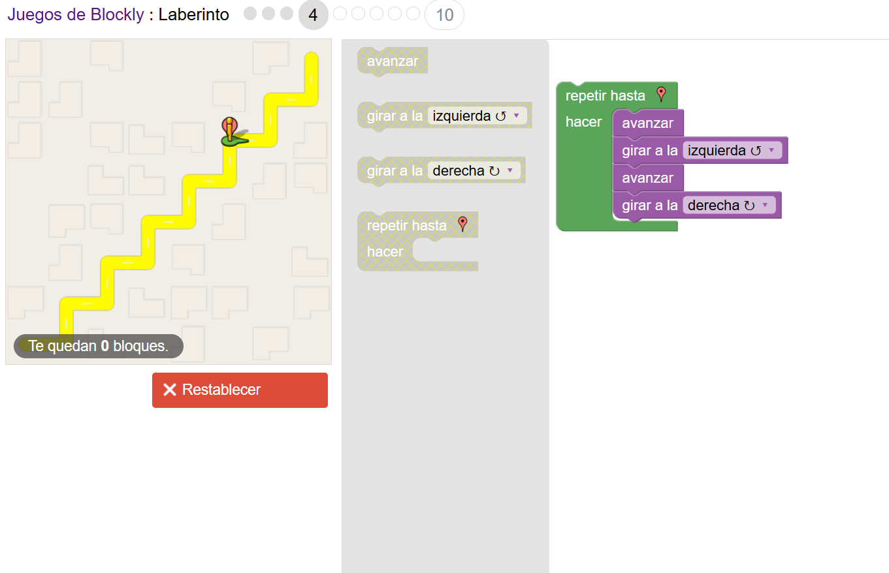

# 🧩 Unidad 1 — Fundamentos de la Programación

---
## 📘 **Contenidos de la Unidad**

### **Algoritmos, pseudocódigo y diagramas de flujo.**

-  🧮 **Algoritmos**
Un **algoritmo** es un conjunto ordenado y finito de operaciones que permiten resolver un problema o realizar una tarea específica.  
Su funcionamiento se basa en una **secuencia lógica de pasos**, similar a una receta, donde cada instrucción debe ser clara, precisa y sin ambigüedades para lograr el resultado deseado.

---

-  💻 **Pseudocódigo**
El **pseudocódigo** es una **descripción informal de un algoritmo**, escrita en un lenguaje natural estructurado que imita la lógica del código, pero sin seguir las reglas estrictas de un lenguaje de programación.  
Su principal propósito es **mostrar el flujo lógico de un programa o sistema**, facilitando la comprensión del proceso antes de traducirlo a un lenguaje formal.

📌 **Ejemplo:** Calcular la edad de una persona, dado su año de nacimiento y el año actual.  

**IMAGEN 1:** Pseudocódigo para calcular la edad.  



---

### 🔄 **Diagrama de Flujo**
Un **diagrama de flujo** es una representación visual que muestra el proceso o secuencia de pasos de un algoritmo.  
Utiliza **símbolos estandarizados** (óvalos, rectángulos, rombos, flechas, etc.) para representar operaciones, decisiones y el flujo general del programa.

📌 **Ejemplo:** Diagrama de flujo que calcula la edad del usuario, dado su año de nacimiento y el año actual.  

**IMAGEN 2:** Diagrama de flujo del cálculo de edad.  



---

### 🧩 **Programación por Bloques**
La **programación por bloques** es una forma visual de crear programas utilizando bloques gráficos que representan instrucciones.  
Cada bloque cumple una función específica (acciones, condiciones, bucles, variables, etc.) y se conectan entre sí como piezas de rompecabezas para formar el flujo del programa.  



Este enfoque es ideal para **principiantes y entornos educativos**, ya que permite centrarse en la lógica de la programación sin preocuparse por la sintaxis.  
Algunos ejemplos de entornos que usan este método son **Scratch, Blockly y GDevelop**.

📘 **Ventajas:**
- Facilita la comprensión de la lógica de los programas.  
- Reduce errores sintácticos.  
- Favorece el aprendizaje visual y práctico.  

📌 **Ejemplo:** Programa en bloques que calcula la edad del usuario y la muestra en pantalla.

---

### ⚙️ **Ejemplos de Algoritmos con Estructuras Lineales o Secuenciales**
Una **estructura secuencial** es aquella en la que las instrucciones se ejecutan **una tras otra**, en el mismo orden en que se escriben, sin saltos ni decisiones intermedias.

📘 **Ejemplo práctico:**  
Algoritmo que calcula el área de un rectángulo:

```pseudocode
Algoritmo CalcularAreaRectangulo
	Definir base, altura, area Como Real;
	
	Escribir "Ingrese la base del rectángulo:";
	Leer base;
	
	Escribir "Ingrese la altura del rectángulo:";
	Leer altura;
	
	area = base * altura;
	
	Escribir "El área del rectángulo es: ", area;
FinAlgoritmo
```

📊 Este tipo de algoritmo se utiliza en situaciones donde **todas las instrucciones deben ejecutarse exactamente una vez y en orden**.

---

### 🚧 **Principales Dificultades en la Aplicación de los Contenidos**
Durante el aprendizaje y aplicación de los algoritmos, pseudocódigos y diagramas de flujo, suelen presentarse algunas dificultades comunes:

- Confusión al **identificar la secuencia lógica** correcta de pasos.  
- Uso incorrecto de los **símbolos en los diagramas de flujo**.  
- Problemas para **traducir un pseudocódigo a un lenguaje de programación real**.  
- Dificultad para **diseñar algoritmos eficientes** que resuelvan el problema sin redundancias.  
- Errores al **comprender la relación entre entrada, proceso y salida**.  

💡 **Recomendación:** practicar con ejercicios simples y comparar soluciones, utilizando tanto pseudocódigo como diagramas de flujo, ayuda a fortalecer la comprensión del proceso lógico.


---

## 📝 **Tareas Entregadas**

<div align="center">

<table>
  <tr>
    <th>📚 Título</th>
    <th>🖊️ Descripción</th>
    <th>🔗 Enlace</th>
  </tr>
  <tr>
    <td><b>Tarea 1:</b> Primer Acercamiento</td>
    <td>Primer acercamiento a la construcción de algoritmos con estructuras secuenciales en pseudocódigo.</td>
    <td><a href="https://drive.google.com/file/d/152bzALVXT-AoEI_l1PbVG_yGk7Gsi-qz/view?usp=drive_link.md">Ver deber</a></td>
  </tr>
  <tr>
    <td><b>Tarea 2:</b> Diseño de Algoritmo</td>
    <td>Del diseño del algoritmo con estructuras secuenciales a la construcción del programa..</td>
    <td><a href="https://drive.google.com/file/d/14mabnbSOWlxdCAS9pXrH_x5-ZGDVL2kw/view?usp=drive_link.md">Ver deber</a></td>
  </tr>
  <tr>
    <td><b>Tarea 3:</b> Exploracion y uso de Herramientas</td>
    <td>Exploración y uso de herramientas digitales para pseudocódigo y diagramas de flujo.</td>
    <td><a href="https://drive.google.com/file/d/1WeVUnB9ImfV-kOxk-2VVuvFJ9ofL9zMk/view?usp=drive_link.md">Ver deber</a></td>
  </tr>
  <tr>
    <td><b>Tarea 4:</b> Instalacion de Programas</td>
    <td>Revisión de tutoriales oficiales de instalación de lenguajes de programación (C, Python o Java).</td>
    <td><a href="https://drive.google.com/file/d/1zeNKcmTIFCxACPx4wcPHMo48C1_BM9B1/view?usp=drive_link.md">Ver deber</a></td>
  </tr>
</table>

</div>

---

## 💾 Códigos de Programación realizados

<div align="center">

<a href="./Actividades/Unidad1" style="
    background: linear-gradient(90deg, #1E88E5, #42A5F5);
    color: white;
    padding: 10px 25px;
    text-decoration: none;
    font-size: 16px;
    font-weight: bold;
    border-radius: 8px;
    box-shadow: 0 3px 8px rgba(0,0,0,0.2);
    display: inline-block;
    margin: 5px;
">
💻 Códigos en C
</a>

<a href="./Actividades/Unidad1PSeInt" style="
    background: linear-gradient(90deg, #1E88E5, #42A5F5);
    color: white;
    padding: 10px 25px;
    text-decoration: none;
    font-size: 16px;
    font-weight: bold;
    border-radius: 8px;
    box-shadow: 0 3px 8px rgba(0,0,0,0.2);
    display: inline-block;
    margin: 5px;
">
💻 Códigos en PSeInt
</a>

</div>

---

## 💭 **Reflexión Crítica de los Aprendizajes de la Unidad**

<div style="
  border-left: 6px solid #0078D7;
  background-color: #f3f9ff;
  padding: 16px;
  border-radius: 8px;
  line-height: 1.6;
  font-size: 16px;
">

<p>
Durante el desarrollo de la <b>Unidad 1: Fundamentos de Algoritmos y Programas</b>, comprendí la importancia de estructurar el pensamiento lógico antes de escribir cualquier línea de código.
</p>

<p>
Aprendí a representar procesos mediante <b>pseudocódigo</b> y <b>diagramas de flujo</b>, lo cual facilita la comprensión del problema y evita errores en la implementación.
</p>

<p>
Además, el trabajo con <b>estructuras secuenciales</b> permitió fortalecer las bases de la programación, entendiendo que cada instrucción tiene un propósito dentro del flujo del algoritmo.
</p>

<p>
Identifiqué también las <b>principales dificultades</b>, como la traducción de la lógica humana a un lenguaje formal, lo que exige práctica constante y atención a los detalles.
</p>

<p>
En conclusión, esta unidad me ayudó a desarrollar un pensamiento más <b>analítico, ordenado y preciso</b>, cualidades fundamentales para avanzar hacia unidades más complejas de programación.
</p>

</div>

---

<p align="center">
  <a href="../principal" style="
    display:inline-block;
    background-color:#0078D7;
    color:#fff;
    padding:10px 18px;
    border-radius:8px;
    text-decoration:none;
    font-weight:bold;
  ">
    🏠 Ir a la Página Principal
  </a>
</p>

---
