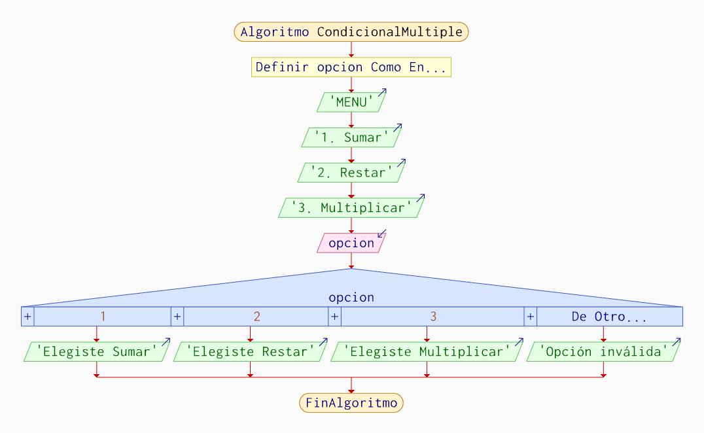
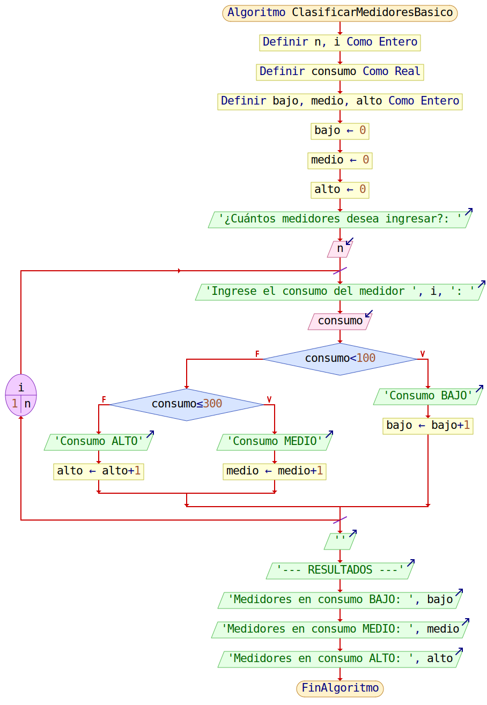
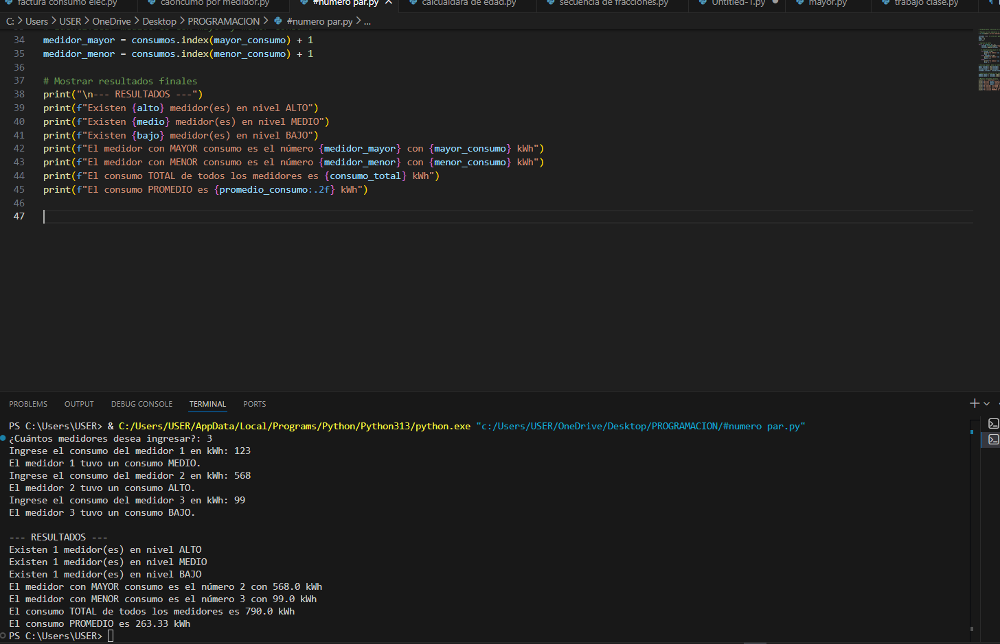

# 🧩 Unidad 2 — Estructuras algorítmicas de control

---
## 📘 **Contenidos de la Unidad**

## **Estructura Algorítmicas Condicionales y Estructuras algorítmicas Repetitivas**:
Las estructuras condicionales son aquellas que permiten que un programa tome decisiones, es decir:

👉 Ejecutan una acción si se cumple una condición,

👉 y otra acción si no se cumple.

Las estructuras algorítmicas repetitivas (también llamadas estructuras de repetición o bucles) son aquellas que permiten ejecutar una o varias instrucciones varias veces, siempre que se cumpla una condición.
## Estructuras algorítmicas Repetitivas

## Estructura while

### Definición  

El ciclo while es una estructura repetitiva que ejecuta un conjunto de instrucciones *mientras una condición lógica sea verdadera*. Antes de iniciar cada iteración, el programa evalúa la condición; si esta se cumple, se ejecuta el cuerpo del bucle, y el proceso continúa hasta que la condición resulte falsa.

Según W3Schools y GeeksforGeeks, este tipo de bucle se conoce como *bucle de condición inicial, pues verifica la condición *antes de ejecutar las instrucciones. Esto garantiza un control riguroso, ya que es posible que el ciclo nunca se ejecute si la condición es falsa desde el principio.

### Usos comunes  

El ciclo while se utiliza cuando:
- Se desconoce la cantidad exacta de repeticiones.  
- La repetición depende del valor de una variable que cambia en cada iteración.  
- Se espera que el usuario ingrese un dato válido y se pregunta repetidamente hasta lograrlo.  
- Se deben procesar datos mientras exista un criterio lógico que lo permita.  

Es ideal para operaciones dependientes de condiciones dinámicas, como lecturas desde archivos, menús interactivos o cálculos que requieren validar un estado antes de continuar.

### Sintaxis  

c
while (condición) {
    // instrucciones mientras la condición sea verdadera
}


### Características importantes  

- Puede ejecutar *cero o más* iteraciones.  
- Si la condición nunca cambia, puede provocar un *bucle infinito*.  
- Es una opción flexible para condiciones complejas.  

### Ejemplo del Uso del Bucle While

### Realizar un programa que presente los 10 primeros numero naturales, en orden ascendente de (1-10).

### Diagrama de Flujo


### Codificación en C:

c
#include <stdio.h>
int main()
{
    int i;
    i = 1;
    while (i <= 10)
    {
        printf("%i \n", i);
        i++;
    }
} 


Este programa es muy simple, solo presenta por pantalla los 10 primeros numeros naturales, del 1 al 10, mediante el bucle repetitivo while, si la condicion se cumple, el bucle se sigue repitiendo, pero si en algun momento es falsa, solo salta fuera del bucle a continuar con el algoritmo, que en este caso, es el final del codigo.

### Prueba de Escritorio:


---

## Estructura for

### Definición  

El ciclo for es una estructura repetitiva diseñada para realizar iteraciones controladas que requieren un número determinado de repeticiones. Está formado por tres expresiones fundamentales:

1. *Inicialización*  
2. *Condición de continuación*  
3. *Actualización del contador*

Como explican Newtum y JDoodle, esta estructura es muy útil cuando se conoce por adelantado el número de veces que el ciclo debe repetirse. Además, agrupa sus tres componentes en una sola línea, lo cual permite un código más compacto y legible.

### Usos comunes  

Se utiliza en situaciones como:
- Recorrer un rango numérico.  
- Iterar sobre arreglos o listas.  
- Realizar operaciones repetitivas con un contador.  
- Ejecutar procesos de forma predecible y estructurada.  
- Algoritmos matemáticos y computacionales (sumatorias, factoriales, secuencias, etc.).  

### Sintaxis  

c
for (inicialización; condición; actualización) {
    // instrucciones que se repiten
}


### Características importantes  

- Es ideal cuando se conoce la cantidad exacta de repeticiones.  
- Su estructura compacta mejora la lectura del código.  
- Evita errores de actualización del contador, ya que lo incluye en su sintaxis.  
- Es más eficiente al recorrer estructuras de datos.

### Ejemplo de Uso del Bucle Repetitivo For:

### Realizar un programa que presente los 10 primeros numero naturales, en orden ascendente de (1-10).

### Diagrama de Flujo:


### Codificación en C:

c
#include <stdio.h>
int main()
{
    int i;
    for (i = 1; i <= 10; i++)
    {
        printf("%i \n", i);
    }
}

Este programa es muy simple, solo presenta por pantalla los 10 primeros numeros naturales, del 1 al 10, mediante el bucle repetitivo for, pero tiene una pequeña, gran diferencia, con la estructura while, la cual es, que tanto la inicializacion, la condicion y el incremento, se encuentran ubicados en la misma linea, lo que ayuda un montón, a la estructura del algoritmo. Ademas, el codigo funciona de la misma manera que en el bucle while.

### Prueba de Escritorio:


---

## Estructura do–while

### Definición  

El ciclo do–while es similar al while, pero con una diferencia fundamental:  
*primero ejecuta el bloque de instrucciones y luego evalúa la condición.*

Esto garantiza que el cuerpo del ciclo se ejecute *al menos una vez, independientemente del valor inicial de la condición. *W3Schools destaca que este bucle se usa cuando se necesita una ejecución mínima garantizada, como en menús, validaciones iniciales o procesos interactivos con el usuario.

### Usos comunes  

Se utiliza cuando:
- Se necesita ejecutar el ciclo al menos una vez.  
- El usuario debe ingresar un dato y se debe validar posteriormente.  
- Se implementan menús que se repiten hasta que el usuario elija salir.  
- Se debe realizar una acción antes de comprobar la condición.  

### Sintaxis  

c
do {
    // instrucciones que se ejecutan al menos una vez
} while (condición);


### Características importantes  

- Garantiza *una ejecución inicial obligatoria*.  
- Es útil en estructuras de interacción con el usuario.  
- Puede provocar bucles infinitos si no se controla adecuadamente.  
- Representa un bucle de condición *final*, no inicial.

### Ejemplo de Uso del Bucle Repetitivo Do-While:

### Realizar un programa que presente los 10 primeros numero naturales, en orden ascendente de (1-10).

### Diagrama de Flujo:


### Codificación en C:
c
#include <stdio.h>
int main()
{
    int i;
    i = 1;
    do
    {
        printf("%i \n", i);
        i++;
    } while (i <= 10);
}

Este programa es muy simple, solo presenta por pantalla los 10 primeros numeros naturales, del 1 al 10, mediante el bucle repetitivo do-while, siendo ua variante, muy utilizada del while, debido a que su sintaxis, obliga al programa a ejecutarse, por lo menos una vez, siendo muy aplicada, al momento de realizar calculos de notas o de diferentes ejercicios que necesiten un bucle repetitivo.

### Prueba de Escritorio:


---
## Estructura Algorítmicas Condicionales
###  Estructura Condicional Simple (Si .. Entonces)
La estructura condicional simple es una estructura de decisión que permite ejecutar una instrucción solo si se cumple una condición.

👉 Si la condición es verdadera, se ejecuta la acción.

👉 Si la condición es falsa, no pasa nada y el programa sigue.

**IMAGEN 1:** Diagrama de flujo 


**Ejemplo** En c++
```
#include <stdio.h>

int main() {
    int edad;

    printf("Escriba su edad: ");
    scanf("%d", &edad);

    if (edad >= 18) {
        printf("Usted es mayor de edad");
    }

    return 0;
}
```


## Estructura condicional Doble (Si ..Entonces, Sino ..)
La estructura condicional doble es una estructura de decisión que permite al programa elegir entre dos opciones:

👉 Si la condición es verdadera → ejecuta una acción

👉 Si no (SINO) → ejecuta otra acción diferente

**IMAGEN 2:** Diagrama de flujo 


**Ejemplo** En c++
```
#include <stdio.h>

int main() {
    int nota;

    printf("Ingrese su nota: ");
    scanf("%d", &nota);

    if (nota >= 7) {
        printf("Aprobado");
    } else {
        printf("Reprobado");
    }

    return 0;
}
```
##  Estructura Condicional Múltiple (En caso de ….) 
La estructura condicional múltiple permite al programa elegir entre más de dos opciones, según el valor de una variable

**IMAGEN 3:** Diagrama de flujo 



**Ejemplo** En c++
```
#include <stdio.h>

int main() {
    int opcion;

    printf("MENU\n");
    printf("1. Sumar\n");
    printf("2. Restar\n");
    printf("3. Multiplicar\n");
    scanf("%d", &opcion);

    switch (opcion) {
        case 1:
            printf("Elegiste Sumar");
            break;
        case 2:
            printf("Elegiste Restar");
            break;
        case 3:
            printf("Elegiste Multiplicar");
            break;
        default:
            printf("Opcion invalida");
            break;
    }

    return 0;
}
```
## Programa combinado realizado en Python 

###  Descripcion del problema

- La empresa eléctrica necesita analizar el consumo energético registrado por varios medidores de luz. Para ello se requiere un programa que
permita ingresar el consumo en kilovatios-hora (kWh) de N medidores eléctricos y que posteriormente realice una clasificación y un análisis 
estadístico de dichos consumos.
- El programa debe permitir al usuario indicar cuántos medidores se van a evaluar e ingresar el consumo individual de cada uno. Con esta 
información, el sistema debe:
- Clasificar cada medidor según su nivel de consumo:
  
Bajo: menos de 100 kWh

Medio: entre 100 y 300 kWh

Alto: más de 300 kWh

Contabilizar cuántos medidores pertenecen a cada categoría.

- Determinar datos estadísticos, tales como:
  
El mayor consumo registrado y el número del medidor al que pertenece.

El menor consumo registrado y el número del medidor correspondiente.

El consumo total de todos los medidores.

El promedio general de consumo.

- Finalmente, el programa debe mostrar un resumen completo con todos los resultados obtenidos.

### Programa en Python
```
# Programa para clasificar el consumo de N medidores eléctricos

# Pedimos cuántos medidores se van a ingresar
n = int(input("¿Cuántos medidores desea ingresar?: "))

consumos = []  # lista para guardar los consumos
bajo = 0
medio = 0
alto = 0

# Ingreso de datos
for i in range(1, n + 1):
    consumo = float(input(f"Ingrese el consumo del medidor {i} en kWh: "))
    consumos.append(consumo)

    # Clasificación según el consumo
    if consumo < 100:
        print(f"El medidor {i} tuvo un consumo BAJO.")
        bajo += 1
    elif consumo <= 300:
        print(f"El medidor {i} tuvo un consumo MEDIO.")
        medio += 1
    else:
        print(f"El medidor {i} tuvo un consumo ALTO.")
        alto += 1

# Calcular mayor, menor y total de consumo
mayor_consumo = max(consumos)
menor_consumo = min(consumos)
consumo_total = sum(consumos)  # suma de todos los consumos
promedio_consumo = consumo_total / n  # promedio de consumo

# Identificar medidores con mayor y menor consumo
medidor_mayor = consumos.index(mayor_consumo) + 1
medidor_menor = consumos.index(menor_consumo) + 1

# Mostrar resultados finales
print("\n--- RESULTADOS ---")
print(f"Existen {alto} medidor(es) en nivel ALTO")
print(f"Existen {medio} medidor(es) en nivel MEDIO")
print(f"Existen {bajo} medidor(es) en nivel BAJO")
print(f"El medidor con MAYOR consumo es el número {medidor_mayor} con {mayor_consumo} kWh")
print(f"El medidor con MENOR consumo es el número {medidor_menor} con {menor_consumo} kWh")
print(f"El consumo TOTAL de todos los medidores es {consumo_total} kWh")
print(f"El consumo PROMEDIO es {promedio_consumo:.2f} kWh")

```
### Diagrama de flujo

### Programa ejecutado 


---

### 🚧 **Principales Dificultades en la Aplicación de los Contenidos**
- A veces se me complica plantear bien las condiciones.
Me confundo con los operadores (==, >, <, &&, ||) y eso hace que el programa no haga exactamente lo que quiero.

- Me cuesta decidir qué estructura usar en cada caso.
A veces no sé si usar un if, un for, un while o un do…while, y eso hace que tarde más en resolver los ejercicios o que escoja una estructura que no es la más adecuada. 

💡 **Recomendación:** Practicar con ejercicios pequeños y variados ayuda bastante a comprender mejor cuándo usar cada estructura. Empezar con ejemplos simples permite entender bien las condiciones y el control de los ciclos, y poco a poco se vuelve más fácil identificar la estructura adecuada para cada problema.

## 💭 **Reflexión Crítica de los Aprendizajes de la Unidad**

<div style="
  border-left: 6px solid #0078D7;
  background-color: #f3f9ff;
  padding: 16px;
  border-radius: 8px;
  line-height: 1.6;
  font-size: 16px;
">

<p>
Durante el desarrollo de la <b> Unidad 2 : Estructuras Condicionales y Repetitivas </b> </p>
Aprendí que las estructuras condicionales permiten a los programas tomar decisiones según una condición, mientras que las estructuras repetitivas hacen posible ejecutar acciones varias veces de manera automática. Estos temas son esenciales para crear programas más ordenados, dinámicos y eficientes. Gracias a esta unidad, fortalecí mi pensamiento lógico y comprendí mejor cómo resolver problemas de forma estructurada mediante la programación.
</div>


---


## 📝 **Tareas Entregadas**
<div align="center">

<table>
  <tr>
    <th>📚 Título</th>
    <th>🖊️ Descripción</th>
    <th>🔗 Enlace</th>
  </tr>
  <tr>
    <td><b>Tarea 1:</b> Control de aprendizaje de programas utilizando estructuras condicionales.</td>
    <td>Aplicar estructuras condicionales en la resolución de problemas mediante la construcción de programas simples y funcionales.</td>
    <td><a href="https://drive.google.com/file/d/1Qb1_JBOakmHkbqn1TetcU75xeT2UHu_g/view?usp=sharing">Ver deber</a></td>
  </tr>
  <tr>
    <td><b>Tarea 2:</b> Aplicación de estructuras condicionales en la resolución de problemas.</td>
    <td>Comprender y aplicar las estructuras condicionales simples, dobles y múltiples en la resolución de problemas.</td>
    <td><a href="https://drive.google.com/file/d/1CVp4YtcFJC52Xb4g3mS8W0jzJTmQZeqN/view?usp=sharing">Ver deber</a></td>
  </tr>
  <tr>
    <td><b>Tarea 3:</b> Aplicación de estructuras repetitivas en la resolución de problemas.</td>
    <td>Comprender y aplicar las estructuras repetitivas en la resolución de problemas.</td>
    <td><a href="https://drive.google.com/file/d/1cSnV3dm1kVTwGS7ijgjP8LEs4oH_uPrP/view?usp=sharing">Ver deber</a></td>
  </tr>
  <tr>
  <td><b>Tarea 4:</b> Diferencias entre los tipos de estructuras condicionales.</td>
    <td>Analizar y representar los diferentes tipos de estructuras condicionales, aplicando diagramas de flujo y codificación en lenguaje de programación.</td>
    <td><a href="https://drive.google.com/file/d/1uG1agXENyUPFQQOrXrT_Wf1nK34mLxh2/view?usp=sharing">Ver deber</a></td>
  </tr>
  <tr>
    <td><b>Tarea 5:</b> Cuadro comparativo entre las estructuras repetitivas </td>
    <td> Analizar y comparar las principales estructuras repetitivas utilizadas en programación, identificando sus características, diferencias y aplicaciones.</td>
    <td><a href="https://drive.google.com/file/d/1Xjj9eUn4_oHjTZy6rJ41SYteusQVtpZO/view?usp=sharing">Ver deber</a></td>
  </tr>
</table>

</div>

<p align="center">
  <a href="../principal" style="
    display:inline-block;
    background-color:#0078D7;
    color:#fff;
    padding:10px 18px;
    border-radius:8px;
    text-decoration:none;
    font-weight:bold;
  ">
    🏠 Ir a la Página Principal
  </a>
</p>
